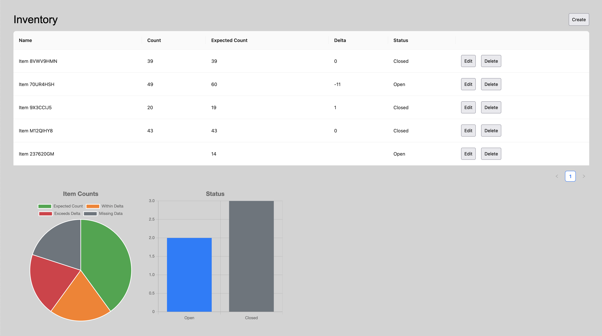

# Inventory Management

Input and visualize simple inventory data utilizing a table and charts. This includes support for custom field validation and basic workflow automation.

## How to run

In the project directory, run `npm install` then `npm start`.

Open [http://localhost:3000](http://localhost:3000) to view it in your browser.
